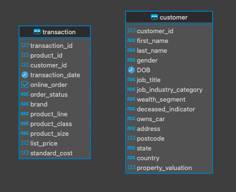

# Группировка данных и оконные функции (vo_HW)

---
Таблицы созданы средствами DBeaver, данные вставлены средствами DBeaver.



## Задание 1
Вывести распределение (количество) клиентов по сферам деятельности, 
отсортировав результат по убыванию количества.

Запрос:
```postgresql
SELECT
    job_industry_category,
    COUNT(*) AS count
FROM customer
WHERE job_industry_category IS NOT null
GROUP BY job_industry_category
ORDER BY count DESC;
```
Результат:

| job\_industry\_category | count |
| :--- | :--- |
| Manufacturing | 799 |
| Financial Services | 774 |
| Health | 602 |
| Retail | 358 |
| Property | 267 |
| IT | 223 |
| Entertainment | 136 |
| Argiculture | 113 |
| Telecommunications | 72 |


## Задание 2
Найти сумму транзакций за каждый месяц по сферам деятельности, отсортировав по месяцам и по сфере деятельности.

Запрос:
```postgresql
SELECT
    date_trunc('month', transaction.transaction_date) as month,
    customer.job_industry_category as job_industry_category,
    SUM(transaction.list_price) as transaction_sum
FROM customer
JOIN transaction ON transaction.customer_id = customer.customer_id
WHERE customer.job_industry_category IS NOT NULL
GROUP BY month, job_industry_category
ORDER BY month, job_industry_category;
```

Результат (Первые 10 строчек):

| month | job\_industry\_category | transaction\_sum |
| :--- | :--- | :--- |
| 2017-01-01 00:00:00.000000 | Argiculture | 43513.81999999999 |
| 2017-01-01 00:00:00.000000 | Entertainment | 64089.91999999999 |
| 2017-01-01 00:00:00.000000 | Financial Services | 366383.7100000002 |
| 2017-01-01 00:00:00.000000 | Health | 286860.3800000003 |
| 2017-01-01 00:00:00.000000 | IT | 107783.36999999997 |
| 2017-01-01 00:00:00.000000 | Manufacturing | 365232.4500000005 |
| 2017-01-01 00:00:00.000000 | Property | 100686.97000000003 |
| 2017-01-01 00:00:00.000000 | Retail | 182375.74999999988 |
| 2017-01-01 00:00:00.000000 | Telecommunications | 31210.200000000004 |
| 2017-02-01 00:00:00.000000 | Argiculture | 60016.81 |


## Задание 3
Вывести количество онлайн-заказов для всех брендов 
в рамках подтвержденных заказов клиентов из сферы IT.


Запрос:
```postgresql
SELECT
    brand,
    COUNT(*) AS count_of_online_orders
FROM customer
JOIN transaction ON transaction.customer_id = customer.customer_id
WHERE (
    customer.job_industry_category = 'IT' and
    transaction.online_order is true and
    transaction.order_status = 'Approved' and
    brand IS NOT NULL
)
GROUP BY brand
ORDER BY count_of_online_orders DESC;
```

Результат:

| brand | count\_of\_online\_orders |
| :--- | :--- |
| Solex | 104 |
| Norco Bicycles | 95 |
| WeareA2B | 93 |
| Giant Bicycles | 93 |
| Trek Bicycles | 86 |
| OHM Cycles | 80 |


## Задание 4
Найти по всем клиентам сумму всех транзакций (list_price), максимум, минимум и количество транзакций, 
отсортировав результат по убыванию суммы транзакций и количества клиентов. 
Выполните двумя способами: используя только group by и используя только оконные функции.
Сравните результат.

Запрос с использованием только group by:
```postgresql
SELECT
    customer_id,
    SUM(list_price) AS sum_list_price,
    MAX(list_price) AS max_list_price,
    MIN(list_price) AS min_list_price,
    COUNT(*) AS count_of_transactions
FROM transaction
GROUP BY customer_id
ORDER BY sum_list_price DESC, count_of_transactions DESC;
```

Результат (Первые 10 строчек):

| customer\_id | sum\_list\_price | max\_list\_price | min\_list\_price | count\_of\_transactions |
| :--- | :--- | :--- | :--- | :--- |
| 2183 | 19071.32 | 2005.66 | 230.91 | 14 |
| 1129 | 18349.27 | 1992.93 | 290.62 | 13 |
| 1597 | 18052.68 | 2091.47 | 360.4 | 12 |
| 941 | 17898.46 | 2091.47 | 1057.51 | 10 |
| 2788 | 17258.94 | 2083.94 | 183.86 | 11 |
| 936 | 17160.24 | 2005.66 | 183.86 | 12 |
| 1887 | 17133.93 | 2091.47 | 688.63 | 11 |
| 1302 | 17035.829999999998 | 1977.36 | 71.16 | 13 |
| 1140 | 16199.240000000002 | 2083.94 | 183.86 | 13 |
| 2309 | 16122.339999999997 | 2091.47 | 290.62 | 12 |

Запрос с использованием только оконных функций:
```postgresql
SELECT
    customer_id,
    SUM(list_price) OVER (PARTITION BY customer_id) AS sum_list_price,
    MAX(list_price) OVER (PARTITION BY customer_id) AS max_list_price,
    MIN(list_price) OVER (PARTITION BY customer_id) AS min_list_price,
    COUNT(*) OVER (PARTITION BY customer_id) AS count_of_transactions
FROM transaction
ORDER BY sum_list_price DESC, count_of_transactions DESC;
```

Результат:

| customer\_id | sum\_list\_price | max\_list\_price | min\_list\_price | count\_of\_transactions |
|:-------------| :--- | :--- | :--- | :--- |
| 2183         | 19071.32 | 2005.66 | 230.91 | 14 |
| 2183         | 19071.32 | 2005.66 | 230.91 | 14 |
| 2183         | 19071.32 | 2005.66 | 230.91 | 14 |
| 2183         | 19071.32 | 2005.66 | 230.91 | 14 |
| ...          | ...  | ...  | ...  | ... |
| 2183 | 19071.32 | 2005.66 | 230.91 | 14 |
| 1129 | 18349.27 | 1992.93 | 290.62 | 13 |
| 1129 | 18349.27 | 1992.93 | 290.62 | 13 |
| 1129 | 18349.27 | 1992.93 | 290.62 | 13 |
| ...          | ...  | ...  | ...  | ... |
| 1129 | 18349.27 | 1992.93 | 290.62 | 13 |
| 1597 | 18052.68 | 2091.47 | 360.4 | 12 |
| 1597 | 18052.68 | 2091.47 | 360.4 | 12 |
| 1597 | 18052.68 | 2091.47 | 360.4 | 12 |

Результат сравнения:

* При использовании агрегирующих функций предложение **GROUP BY** сокращает количество строк в запросе с помощью их группировки.
* При использовании оконных функций количество строк в запросе не уменьшается по сравнении с исходной таблицей. 


## Задание 5
Найти имена и фамилии клиентов с минимальной/максимальной суммой транзакций за весь период 
(сумма транзакций не может быть null). 
Напишите отдельные запросы для минимальной и максимальной суммы.

Запрос:
```postgresql
WITH transactions_sum AS (
    SELECT
        customer.first_name,
        customer.last_name,
        SUM(transaction.list_price) AS sum_list_price
    FROM customer
    JOIN transaction ON transaction.customer_id = customer.customer_id
    GROUP BY customer.first_name, customer.last_name
), min_sum AS (
    SELECT
        MIN(sum_list_price) AS min_sum_list_price
    FROM transactions_sum
), max_sum AS (
    SELECT
        MAX(sum_list_price) AS max_sum_list_price
    FROM transactions_sum
)

SELECT
    first_name,
    last_name,
    sum_list_price
FROM transactions_sum
WHERE (
    sum_list_price = (SELECT min_sum_list_price FROM min_sum) or
    sum_list_price = (SELECT max_sum_list_price FROM max_sum)
);
```

Результат:

| first\_name | last\_name | sum\_list\_price |
| :--- | :--- | :--- |
| Jillie | Fyndon | 19071.32 |
| Hamlen | Slograve | 60.34 |


## Задание 6
Вывести только самые первые транзакции клиентов. Решить с помощью оконных функций.

Запрос:
```postgresql
WITH ranked_transactions AS (
    SELECT *,
           ROW_NUMBER() OVER (PARTITION BY customer_id ORDER BY transaction_date) AS rn
    FROM transaction
)
SELECT transaction_id,
       customer_id,
       transaction_date
FROM ranked_transactions
WHERE rn = 1
ORDER BY customer_id;
```

Результат (Первые 10 строчек):

| transaction\_id | customer\_id | transaction\_date |
| :--- | :--- | :--- |
| 9785 | 1 | 2017-01-05 00:00:00.000000 |
| 2261 | 2 | 2017-05-04 00:00:00.000000 |
| 10302 | 3 | 2017-02-23 00:00:00.000000 |
| 12441 | 4 | 2017-04-03 00:00:00.000000 |
| 2291 | 5 | 2017-03-03 00:00:00.000000 |
| 7096 | 6 | 2017-01-28 00:00:00.000000 |
| 18369 | 7 | 2017-02-18 00:00:00.000000 |
| 10792 | 8 | 2017-01-04 00:00:00.000000 |
| 8591 | 9 | 2017-02-04 00:00:00.000000 |
| 5956 | 10 | 2017-06-20 00:00:00.000000 |


## Задание 7
Вывести имена, фамилии и профессии клиентов, 
между транзакциями которых был максимальный интервал (интервал вычисляется в днях)

Запрос:
```postgresql
WITH customer_transaction_with_interval AS (
    SELECT
        customer.first_name,
        customer.last_name,
        customer.job_title,
        EXTRACT(
            DAY FROM (
                transaction_date - LAG(transaction_date)
                OVER (PARTITION BY customer.customer_id ORDER BY transaction_date)
            )
        ) AS days_interval
    FROM transaction JOIN customer ON customer.customer_id = transaction.customer_id
), max_interval AS (
    SELECT
        MAX(days_interval) AS max_days_interval
    FROM customer_transaction_with_interval
)

SELECT
    *
FROM customer_transaction_with_interval
WHERE days_interval = (SELECT max_days_interval FROM max_interval);
```

Результат:

| first\_name | last\_name | job\_title | days\_interval |
| :--- | :--- | :--- | :--- |
| Susanetta | null | Legal Assistant | 357 |
